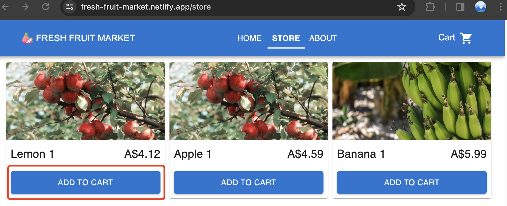
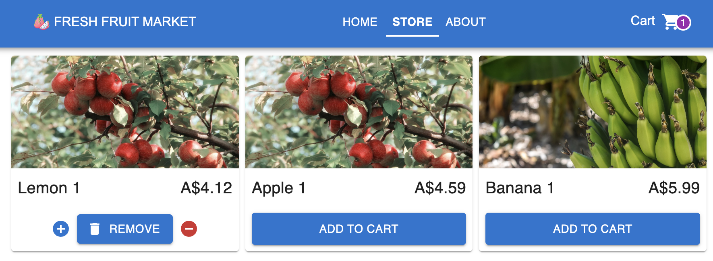
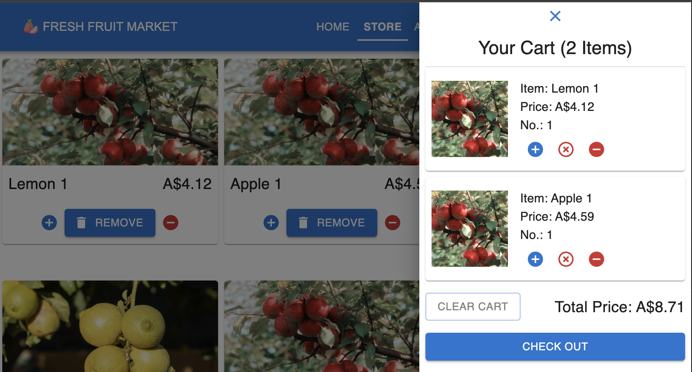
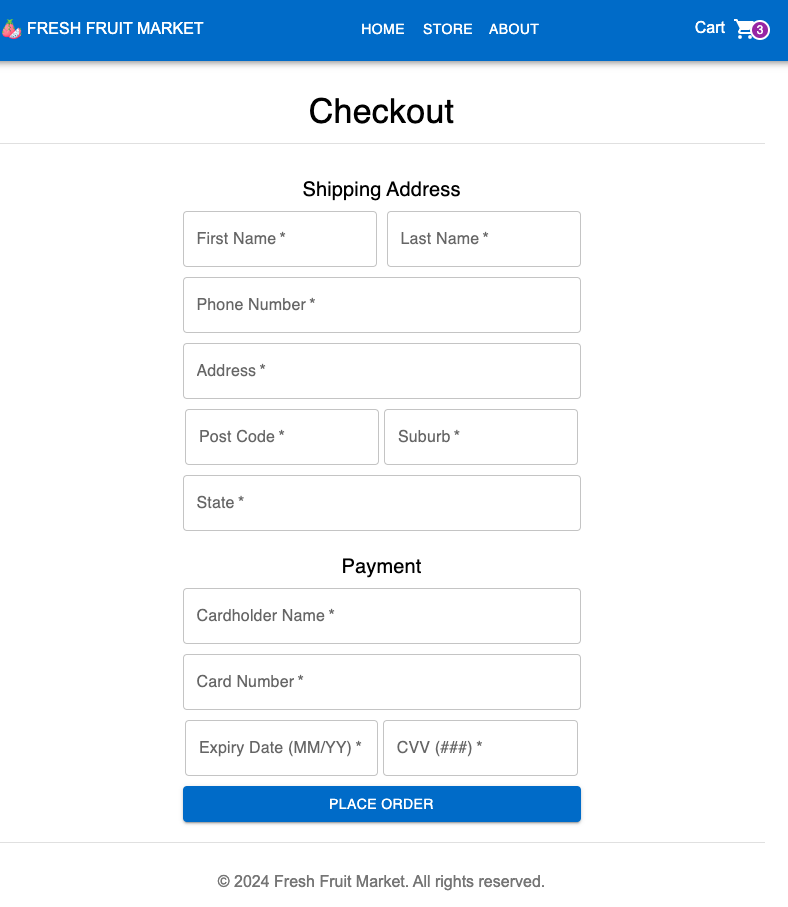

# Simple shopping cart demo
#### [Live Demo](https://fresh-fruit-market.netlify.app/)
## 1. Run Locally
### 1.1. Install Dependencies
```sh
$ npm install
```

### 1.2. Run the app
```sh 
$ npm run dev
```

---

## 2. Build the project
```sh
$ npm run build
```

## 3. CRUD operations
1. Navigate to your site to `/store` page.
2. Click ADD TO CART button to add the item to cart.


3. Click the `+` or `-` button to add or delete one item at a time. Click `REMOVE` button to remove all the items of a fruit from the cart.
4. Click `Cart` icon to open the cart.
5. Click the `+` or `-` button to add or delete one item at a time. Click `X` button to remove all the items of a fruit from the cart. 

6. Click `CLEAR CART` to remove all items.
7. Click `CHECK OUT` to enter `/checkout` page.

8. Click `PLACE ORDER` will clear all items and go back to `\store` page.